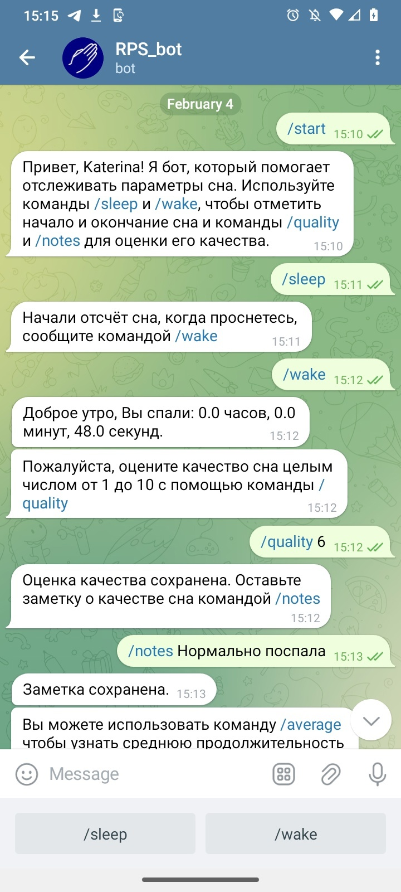
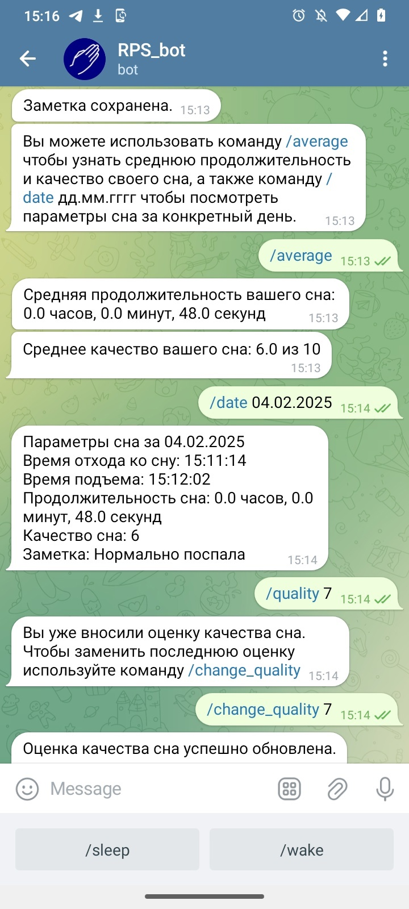

# Телеграм-бот для отслеживания режима сна 

Бот, позволяющий пользователям следить за параметрами и качеством своего сна с помощью нескольких простых команд.

## Примеры использования бота

    
    
  

## Инструкции по установке и запуску бота
Их нет, поскольку я не особо хочу, чтобы кто-то пользовался этим кодом. Но если кто-то самостоятельно разберется, как что и куда - флаг ему в руки. 
